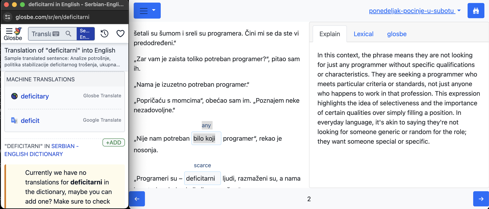

  

# Lexiflux

Master languages faster with our AI-powered reading companion. 

Instantly translate and understand foreign texts as you read, building your vocabulary and comprehension skills effortlessly.

 

## Quick start
There is ready to use [Docker image](https://hub.docker.com/r/andgineer/lexiflux) with Lexiflux.

How to start and use it you can find in [Lexiflux documentation](https://lexiflux.sorokin.engineer).

## Developers
### Build from sources
Clone [the repo](https://github.com/andgineer/lexiflux).

Install [uv](https://github.com/astral-sh/uv).

Install [invoke](https://docs.pyinvoke.org/en/stable/) preferably with 
[`pipx`](https://pypa.github.io/pipx/):

    pipx install invoke

Create development environment:

    . ./activete.sh  # note space between . and ./activate.sh
    invoke buildjs
    invoke init-db
    invoke run

open in web-browser http://localhost:8000

### Local SSL
Generate self-issued keys

    inv keygen

Run server with SSL

    inv runssl

If you want valid sertificate install mkcert. For macOS

    brew install mkcert

Install root certificate

    mkcert -install

Update `runssl` command in Makefile to use this certificates.

### Scripts
To get available scripts:

    inv --list

### Allure test report

* [Allure report](https://andgineer.github.io/lexiflux/builds/tests/)

### Coverage report
* [Codecov](https://app.codecov.io/gh/andgineer/lexiflux/tree/main/src%2Fgarmin_daily)
* [Coveralls](https://coveralls.io/github/andgineer/lexiflux)
