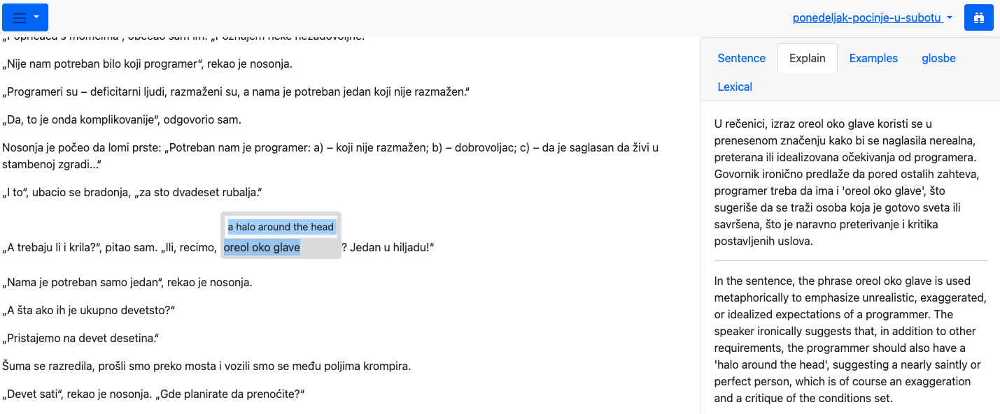

  

# Lexiflux

Read foreign texts with an AI-powered dictionary.

 

## Quick start

    docker run --name lexiflux -d -p 6100:8000 andgineer/lexiflux:latest || docker start lexiflux

Open the lexiflux at http://localhost:6100

## AI Models
(!) To install in the docker local AI Ollama model add `OLLAMA_LOAD_MODEL=llama3` to the `docker run` command.

Please note it will download about 5Gb Ollama AI model and require about 6G RAM for the Docker container to run.

Alternatively you can use ChatGPT, Claude or other managed AI solutions. 
See [AI Settings](http://localhost:6100/ai-settings/) section.

## Build from sources
Clone [the repo](https://github.com/andgineer/lexiflux).

Install [uv](https://github.com/astral-sh/uv).

    . ./activete.sh  # note space between . and ./activate.sh
    make js
    ./manage createsuperuser  # create admin user
    make run

open in web-browser http://localhost:8000

## Local SSL
Generate self-issued keys

    make keygen

Run server with SSL

    make runssl

If you want valid sertificate install mkcert. For macOS

    brew install mkcert

Install root certificate

    mkcert -install

Update `runssl` command in Makefile to use this certificates.

## Scripts
    make help

## Local AI
Lexiflux use AI models to create Lexical Articles in Sidebar 
(you open it with blue binocular icon).

Also you can use AI for inline text translation. By default
it uses Google Translate.

To configure Sidebar and inline translation see Language Tool Preferences.
There are separate settings for each language, so you can configure
different settings for different languages.

If you want to use free local AI, you need to install 
[Ollama](https://ollama.com/download/mac) and preload models.

    ollama pull llama3
    ollama pull zephyr

But I recommend using paid [openAI](https://openai.com/index/openai-api/) 
or [Anthropic](https://www.anthropic.com/api-bk).

They are more accurate and faster.

For paid models you should sign up and get API key.
Place API key into appropriate environment variable.

    export OPENAI_API_KEY=...
    export ANTHROPIC_API_KEY=...

So if you configured using paid models, each time Lexiflux shows you the 
article in the Sidebar, you are charged by AI provider.

## New installation
    make migrate
    ./manage createsuperuser

https://github.com/nidhaloff/deep-translator
https://github.com/terryyin/translate-python

## Allure test report

* [Allure report](https://andgineer.github.io/lexiflux/builds/tests/)

## Coverage report
* [Codecov](https://app.codecov.io/gh/andgineer/lexiflux/tree/main/src%2Fgarmin_daily)
* [Coveralls](https://coveralls.io/github/andgineer/lexiflux)
