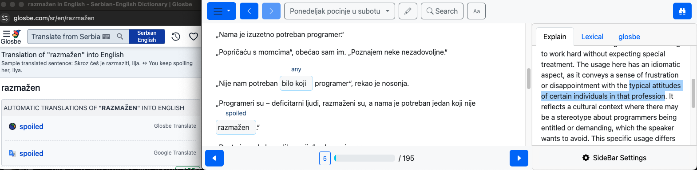

[](https://github.com/andgineer/lexiflux/actions)
[](https://htmlpreview.github.io/?https://github.com/andgineer/lexiflux/blob/python-coverage-comment-action-data/htmlcov/index.html)
<br/><br/>


# Lexiflux reader

**Keep reading. Get help where you need it.**

Read books and articles in another language with translations inside the text
and AI explanations beside it. Bring your own EPUB, HTML, or text files, import
a web page, or send books from Calibre.



* **Stay with the text.** Select a word or phrase for an inline translation;
  open the sidebar for usage, origins, or an explanation of the surrounding sentence.
* **Choose your reading tools.** Configure dictionaries, AI providers, and custom
  prompts separately for each language. Local models through Ollama are supported too.
* **Take vocabulary with you.** Export your lookup history with context to Anki
  through AnkiConnect or an Anki deck file, or download it as CSV.

[Quick start](https://andgineer.github.io/lexiflux/quickstart/) ·
[Documentation](https://andgineer.github.io/lexiflux/) ·
[Docker image](https://hub.docker.com/r/andgineer/lexiflux)

## Under the hood

**A lookup needs its sentence.** The reader maps selected words back to their
sentences and includes surrounding text in AI requests. The selected term and
its sentence are marked separately, so a prompt can distinguish what to explain
from the context that determines its meaning. See the
[context construction](lexiflux/language/llm.py).

**Translations change the page.** An inline explanation changes line lengths and
scroll positions. The TypeScript reader tracks words and translation spans,
merges overlapping or adjacent selections, and adjusts the viewport to keep
the text readable. [Reader tests](tests/js/) cover selection and viewport
behaviour alongside the Python suite.

**Several tools, one reading workflow.** Django manages the library, language
preferences, and lookup history. Dictionaries, external reference sites, and
AI prompts are configurable parts of the same sidebar; an ordinary translation
does not require an LLM. The [AI settings guide](docs/src/en/aimodels.md)
explains the available options, and the [Calibre plugin](lexiflux/calibre_plugin/)
connects an existing ebook library to the reader.

<details>
<summary><b>Contributing</b></summary>

Clone the repository and install [uv](https://docs.astral.sh/uv/), then:

```bash
source ./activate.sh
npm ci
inv buildjs
inv init-db
inv run
```

Open [localhost:8000](http://localhost:8000). `inv init-db` initializes the
database with sample data; `inv run` enables local auto-login.

Run checks from the activated environment:

```bash
inv pre
npm test
python -m pytest tests
```

The browser tests use the Selenium Grid defined in `docker-compose.yml` and
require Docker. `inv test` also generates and opens the Allure report.
See [AGENTS.md](AGENTS.md) for repository conventions and `inv --list` for tasks.

For local HTTPS, run `inv keygen`, then `inv runssl`. To use a locally trusted
certificate, create one with mkcert and configure the certificate paths in
the `runssl` task.

[Allure test report](https://andgineer.github.io/lexiflux/builds/tests/)

</details>
