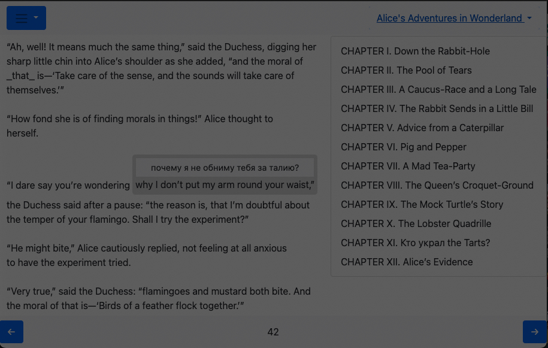

  

# Lexiflux

Reading foreign texts with dictionary.

 

## Scripts
    make help

## New istallation
    make migrate
    python manage.py createsuperuser

https://github.com/nidhaloff/deep-translator
https://github.com/terryyin/translate-python

## Allure test report

* [Allure report](https://andgineer.github.io/lexiflux/builds/tests/)

## Coverage report
* [Codecov](https://app.codecov.io/gh/andgineer/lexiflux/tree/main/src%2Fgarmin_daily)
* [Coveralls](https://coveralls.io/github/andgineer/lexiflux)
